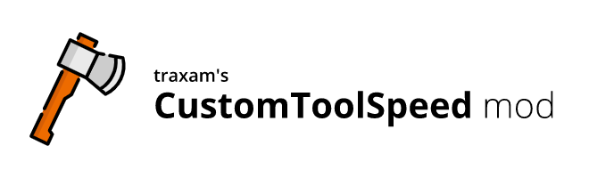



# Custom Tool Speed
*([view on RaftModding](https://www.raftmodding.com/mods/customtoolspeed))*

This mod lets you customize how fast your tools break trees, foundations, walls and everything else.

## Changing the tool speed
Open the console by pressing the `[F10]` key and type the following command to change your tool speed. 

**Command: `toolspeed <speed>`**

**Example:** Typing `toolspeed 2` will double your tools' speed.

## Support
If you have any issues with or ideas for this mod, please message me (@traxam#7012) in the modding section of the [official Raft Discord-server](https://discord.gg/raft).

## Credits
- developed by [traxam](https://trax.am)
- [icon image](https://www.flaticon.com/free-icon/axe_998899) by [Freepik](https://www.freepik.com/), licensed [Creative Commons BY 3.0](http://creativecommons.org/licenses/by/3.0/)
- Thanks to `@Cptpotatoface` for the idea